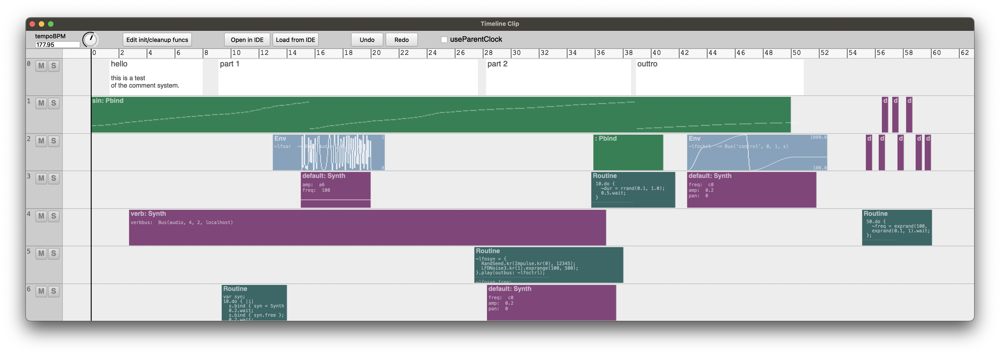
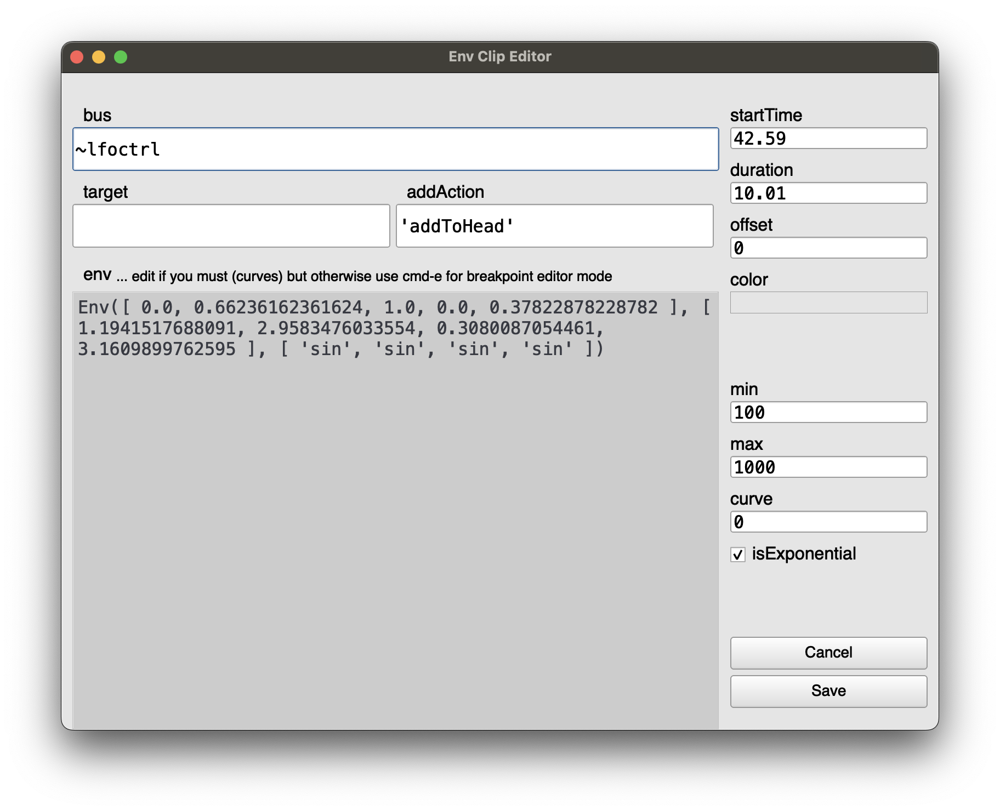
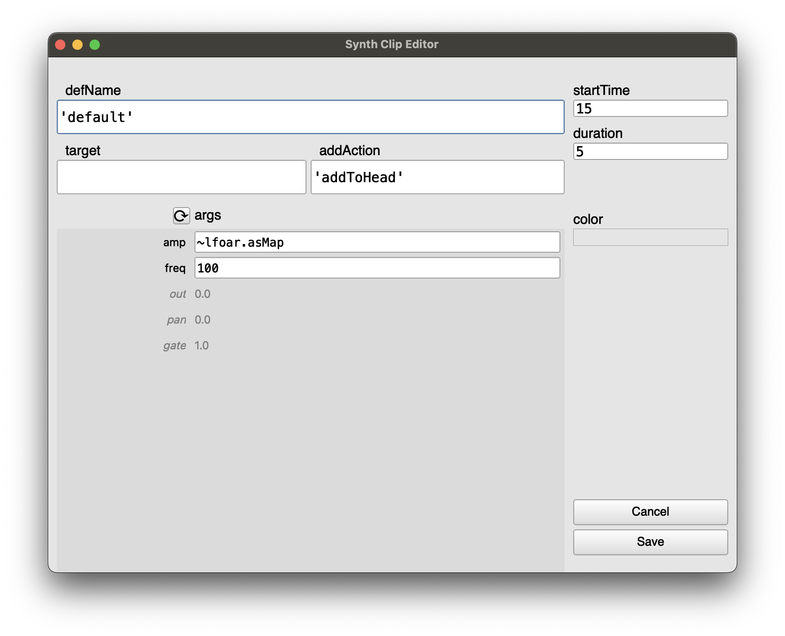
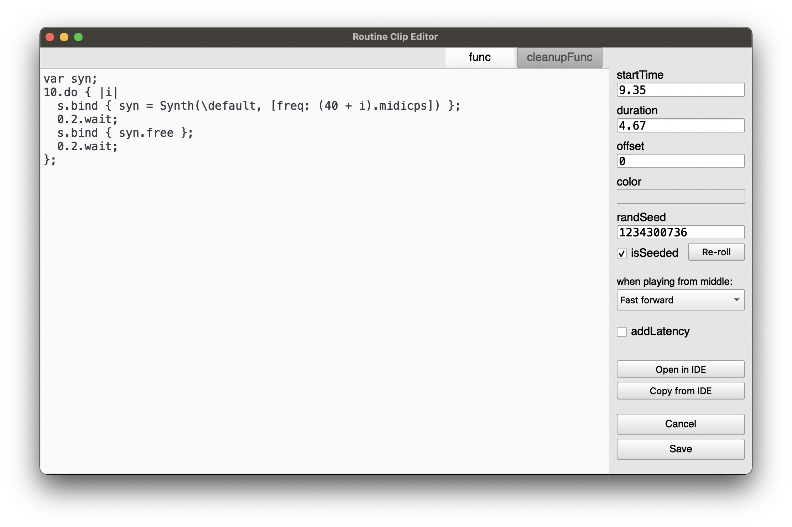
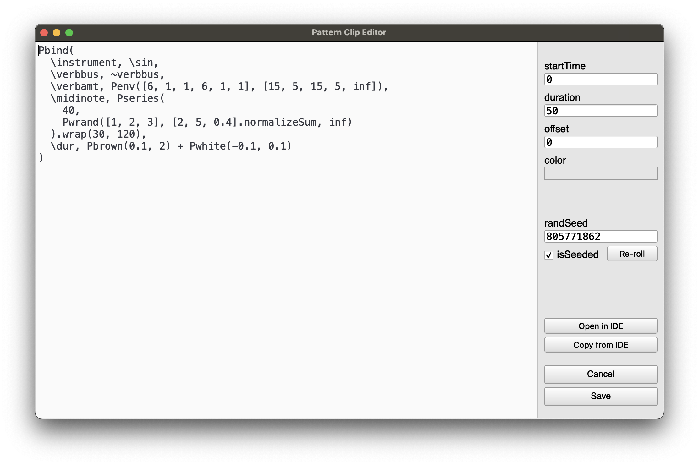
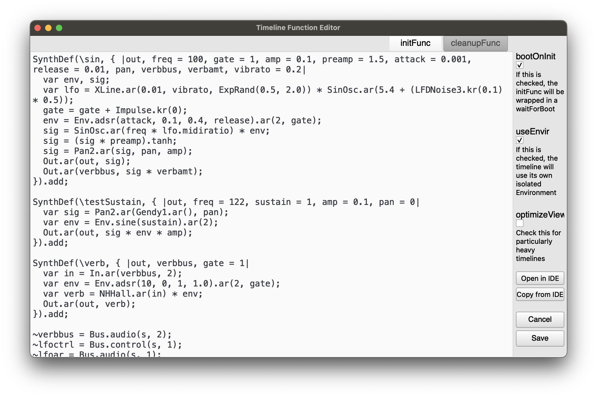

# ESTimeline

The distant goal is that anything you can do in SuperCollider could be sequenced on a visual and editable timeline...

Note that this is a work in progress and all is subject to revision.
<br />
<br />
<details>
  <summary>Out of date screenshots</summary>
  
  
  
  
  
</details>

<details>
  <summary>Out of date video demo: Timelines inside of timelines with optionally separate play clocks</summary>
  http://www.youtube.com/watch?v=8jcxcfvS_08
</details>

<br />
<br />

<details>
  <summary><strong>Features, hypothetical features, and issues</strong></summary>
  
## Features
- **Non-prescriptive:**
  - for the moment just real-time but some of this could be translated easily to work NRT
    - there are certain things impossible in NRT, i.e. to do with real-time input
  - the basic goal is only to "execute this code at this particular time"
    - although the competing goal is to make it easy to do the things you want to do, which is subjective
  - as little architecture as possible is forced on you,
    - possible to disable timeline-specific clock and environment so as to interact with the timeline as part of a larger project
    - possible to play clips with any bus, target, addAction, etc. for full flexibility
      - although I will probably build in optional use of ddwMixerChannel
- **DAW-like GUI** for editing and playback
  - Keyboard and mouse interface to full extent of Timeline capabilities, with built-in code editing
  - Snap to grid optional
  - Gray playhead is "scheduling playhead" and black playhead is "sounding playhead" -- to take into account server latency.
    - Routines can be played with additional latency so non-sounding events line up with the sounding playhead. The goal is an accurate visual representation of what you are hearing / when the code is executed.
- **Non-linear:** "goto" command to jump to a clip or a point in time enabling complex real-time behaviors (variable-length looping, conditional branching...)
- **Tracks** can contain all clip types
  - tracks can be muted/soloed and rearranged
  - individual clips can be muted
- **Synth, Pattern, Routine, and Env** clip types
  - Bulk editing selected clip parameters
  - Env clips play on a bus and come with a shortcut to map to Synths and Patterns, and 
    - can optionally manage their own bus
      - all Env clips with the same name on a timeline share the same bus
  - Clips can reference other clips in the same timeline, to e.g. apply an Env to a Synth parameter
  - Pattern, Routine, Env, and Timeline clips can "fast forward" to start playing in the middle
    - (there is no way to fast forward a Synth, that I know of....)
  - Pattern and Routine clips can be seeded so random number generation is deterministic
  - Most fields can take a Function, so params can be generated on the fly
- **Timeline Clip** -- embed one timeline in another!
  - Each timeline clip can optionally use its own TempoClock, and optionally use its own Environment 
  - Each timeline (and timeline clip) has an init / free hook for e.g. allocating and freeing resources
- **Undo and redo** at each timeline level
- **Save and recall** Easy to export timeline to IDE as plain text, save as .scd, and load it back again

## Hypothetical features
- Time features
  - Indeterminacy: probability for clips not to play?
  - Clock follow: e.g. sync up with an Ableton timeline or midi show control
- Track/clips
  - More clip types (e.g. OSCdef, loop, audio file, midi/piano/drum roll, VST)
  - Optional default MixerChannel per track? and modifiable per clip
  - Reference clips to create clones that all change together
- Envelopes
  - Ability to draw freehand with mouse 
  - More live interaction - e.g. map a controller to a bus and record its movements to an envelope
  - Higher dimensional envelopes - e.g. movement through x/y space
  - Timeline tempo envelopes (this is already possible but kind of annoying, using an Env clip and a Routine clip)
- Playback and record audio files
  - easily access this Buffer for further manipulation
- MIDI integration
  - not sure how DAW-like I want to make this.....
- Library integration
  - ddwMixerChannel for simple, solid bus routing.
  - ddwPlug -- simplify bus routing for modulation
  - VSTPlugin, somehow..... this could be a can of worms
  - clothesline -- put whole .scd files on the timeline

## Issues
1. Although I've tried to make it pleasant, the GUI based code editing environment does not syntax highlight, autocomplete, etc -- for this reason I've added "Open in IDE" / "Copy from IDE" buttons as necessary.
    - Solution would be to someday add a Qt code view to core SC
2. When there are lots of quick zig-zags, high-resolution envelope drawing makes the GUI freeze up
    - to avoid this I have extremely pixelated the envelope drawing when zoomed in. Solution would be to someday at a better Qt envelope view to core sc.
3. There is a limit to the complexity of a timeline created using SCLang (i.e. by evaluating `ESTimeline([ESTrack([....`) -- it may only contain max 256 functions.
    - to avoid this I have created a light custom file format that compiles complex timeline structures from the inside out

<br />
</details>

<details>
  <summary><strong>Getting started: installing and tutorial</strong></summary>
  
## Installing
Download or clone this repository into your SuperCollider Extensions directory. To see where this is, go to `File > Open user support directory` and find the `Extensions` directory, or evaluate:
```
Platform.userExtensionDir
```

## Tutorial: basic workflow examples
```
(
~timeline = ESTimeline();
~window = ESTimelineWindow(timeline: ~timeline);
)
```
- by default, this boots the default server. You can make it not do this by going into "Prep / Cleanup funcs" and unchecking `bootOnPrep`.

### SynthDefs:
- put your SynthDef in the timeline's prep function (click the "edit prep/cleanup funcs" button) e.g.
```
SynthDef(\sin, { |out, freq = 200, gate = 1, amp = 0.1, preamp = 1.5, attack = 0.001, release = 0.01, pan, verbbus, verbamt, vibrato = 0.2|
  var env, sig;
  var lfo = XLine.ar(0.01, vibrato, ExpRand(0.5, 2.0)) * SinOsc.ar(5.4 + (LFDNoise3.kr(0.1) * 0.5));
  gate = gate + Impulse.kr(0);
  env = Env.adsr(attack, 0.1, 0.4, release).ar(2, gate);
  sig = SinOsc.ar(freq * lfo.midiratio) * env;
  sig = (sig * preamp).tanh;
  sig = Pan2.ar(sig, pan, amp);
  Out.ar(out, sig);
  Out.ar(verbbus, sig * verbamt);
}).add;
```
- hit save when you're done to save the prepFunc and load it.

### Making tracks:
- press cmd-t to add a track after the one your mouse is currently over, or shift-cmd-T to add it before the current track
- cmd-delete deletes a track
- each track can contain any kind of clip in any combination
- mute and solo tracks using the buttons on the left panel
- click and drag in the left panel to rearrange tracks

### Synth Clips:
- create a bunch of Synth clips (point the mouse where you want it and press shift-S, or use right click menu)
  - drag them around to move them
  - drag their edges to resize them (a red bar appears when you are within the resize zone)
  - option-drag to copy a clip
  - check the `snapToGrid` box or press opt-s to align your edits with the tempo grid
  - double-click on a clip to edit it, e.g. change the frequency
    - double-click on the grayed out `freq` parameter to activate it, then you can set it to any valid SuperCollider expression
    - press save when you're done
  - if you play now by clicking to place the playhead and pressing space, you will hear they play the default synth
    - press space again to stop playback

### Bulk edit synth clips:
- click in an empty area and drag to select all the Synth clips (they will be highlighted in cyan when selected)
- right click, "clip actions > bulk edit synth defName"
  - and set them to `'sin'`.
  - play again and you hear they now all play your SynthDef
  - double-click in an empty area to remove selection

### Scrolling and zooming:
- use trackpad to scroll left and right or click and drag ruler at top
- cmd-scroll to zoom in and out horizontally
- opt-scroll to zoom in and out vertically (when there are more than one track)

### Envelopes for Synth parameters:
- right click a Synth clip, "clip actions > add env for synth argument"
- pick "freq" from the list and hit OK
  - this will by default add a new track with an envelope clip on it that is the length of your Synth clip, with a unique name (starting from 'freq0'), and it will update the freq argument of the Synth clip to read from this envelope's bus

### Editing Envelopes:
- cmd-e to enter envelope breakpoint editor mode
  - click and drag to move the breakpoints around or adjust curves,
  - shift-click to add breakpoints,
  - option-click to remove them
- by default, these envelopes will map to the range of the parameter name .asSpec
  - to rescale, right click, clip actions > "set env range keeping breakpoint values"
- hit cmd-e again to leave envelope breakpoint editor mode

### Bulk edit Synths -- To make this envelope affect all your Synths:
- drag the edges of the envelope clip to resize it, so that it covers the entire range of your Synth clips
- click and drag to select all the Synth clips
- right click, "clip actions > bulk edit synth arguments"
- assign the `freq` of all the clips to 
`\freq0`
(or whatever the name of the envelope clip is)
- you should see all their freqs change to `a4` -- this is the audio rate bus that the Env clip has created for you (you can override this behavior)
- cmd-e to edit the breakpoints again
- you should hear it is now controlling all the synths' pitches
- make sure you've left breakpoint edit mode when you want to move clips around

### Bulk edit Synths -- Random panning:
- Select all your Synth clips
- right click > clip actions > bulk edit synth arguments
- for `pan` put in `rrand(-1.0, 1.0)` and check the "hard coded" box
  - this will generate a random hard-coded pan per clip. (if you want it to be newly random every time you play it, uncheck the box)

### Environment variables -- adding reverb:
- add to your timeline prep func:
```
SynthDef(\verb, { |out, verbbus, gate = 1, amp = 1|
  var in = In.ar(verbbus, 2);
  var env = Env.adsr(0.01, 0, 1, 1.0).ar(2, gate);
  var verb = NHHall.ar(in) * env;
  Out.ar(out, verb * amp);
}).add;

~verbbus = Bus.audio(s, 2);
```
- and to the cleanup func:
```
~verbbus.free;
```
- save the changes to load the new SynthDef and bus
  - this environment variable is local to this timeline (assuming `useEnvir` box is still checked)
- cmd-t to make a new track
- click in an empty area and drag to select the time around all your Synth clips
- put the mouse over your new track and shift-S to create a new Synth clip that fills the selected time
- double click on it
  - set defName to `'verb'`
  - set addAction to `'addToTail'`
  - click refresh icon next to args to refresh argument names
  - double click on grayed-out "verbbus" to activate it, put `~verbbus`
  - save
    - you should see that verbbus is now set to e.g. `a4`
- click and drag to select all your Synths, bulk edit Synth arguments, and set `verbbus` to `~verbbus`
  - again, you should see that they all have verbbus set to the same bus number
- bulk edit the same synth arguments and set `verbamt` to `1.0`
  - now when you play you will hear they all are affected by the reverb Synth.
- you could now make an envelope to control the amplitude of this reverb, analogous to overall return level.
- you could also make an envelope to control the verbamt of all of the Synths, analogous to send level.

### Pattern Clips:
- make a new track and shift-P to make a pattern clip
- double click to edit, e.g.:
```
Pbind(
  \instrument, \sin,
  \verbbus, ~verbbus,
  \verbamt, Pwhite(0.0, 1.0).linexp(0, 1, 0.1, 3.0),
  \degree, Pbrown(0, 7 * 3 + 1, 3),
  \octave, Pdup(Pwhite(1, 10), Pwhite(3, 5)),
  \pan, Pwhite(-1.0, 1.0),
  \dur, Pbrown().linexp(0, 1, 0.02, 1.0)
)
```
- you will hear this uses the same reverb synth
- if you want to try a new random seed, click "re-roll" button and save
  - you can always undo if you don't like it
- you can drag the edges to adjust start and end point without changing the timing of the notes
  - you can split it into two by pointing with the mouse where you want the split and pressing s
- if you make a new track and a new envelope, name the envelope `pan0` and set its range from -1 to 1
- edit the panning to your liking, and update the pattern(s) with
```
  \pan, ~thisTimeline[\pan0],
```
    
### Timeline clips:
- above the main timeline, click "Open as clip in new timeline"
  - Now this little system, the synths, patterns, buses and envelopes, are all encapsulated in this timeline clip, which won't interfere with e.g. another ~verbbus that you happen to use elsewhere.
  - (in fact you can duplicate the timeline clip by option-dragging onto a new track, and the two will play simultanously each using its own environment and bus.)
  - you can also resize the clips, move the mouse cursor over the clip and use the s key to split it into two separate timeline clips, etc.

### Using Routine clips:
- shift-R to make a Routine clip, double click to edit
- it's important to use `s.bind` for server operations inside of routines, otherwise the timing is off.
```
var syn;
10.do { |i|
  s.bind { syn = Synth(\default, [freq: (40 + i).midicps]) };
  0.2.wait;
  s.bind { syn.free };
  0.2.wait;
};
```
- You can think of Routine clips as kind of your generic "execute this code here", and if you want say OSC out to a light board to line up with the sounding events, check the `addLatency` box.
- You can interact with the timeline using `~thisTimeline` which always refers to the timeline you're currently working in, or `~timeline` which refers to either this or the nearest parent timeline whose `useEnvir` box is checked
  - if no parent timeline is set to `useEnvir`, then `~thisTimeline` will overwrite anything you might have in your current environment.
  - in that case, `~timeline` might be nil unless you've set it in your current environment.
- to get the current value of an envelope named `env` from within a routine:
```
loop {
  ~thisTimeline[\env].valueNow.postln;
  1.wait;
};
```
- to jump to a clip named `next`, use
```
~thisTimeline.goto(\next)
```
- you can use a comment clip (shift-C) for this dummy "next" clip -- the first line of the comment is its name
- you can also goto a number, which will be interpreted as beat number.
<br />
</details>

<details>
  <summary><strong>Keyboard and mouse actions</strong></summary>
  
## Mouse interaction
- drag middle of clip to move
- drag edges of clip to resize
- double click on clip to open editor window
- right click anywhere to see action menu
- Zooming
  - cmd-scroll zoom horizontally
  - opt-scroll zoom vertically
- Envelope breakpoint editing (cmd-e to toggle this mode)
  - click and drag to move breakpoints or adjust curves
  - shift-click to add breakpoint
  - opt-click to remvove breakpoint
- Selecting
  - click and drag to select both time and clips
    - hold cmd to just select clips
    - hold opt to just select time
  - hold shift to add/remove clips from existing selection
- click and drag tracks to rearrange

## Key commands
- space toggles play
- opt-s toggles snap to grid
- Navigation
  - enter goes to beginning of timeline
  - [ and ] go to next/previous clip edge on track under mouse
- Editing clip
  - m mutes clip at mouse pointer
  - s splits clip at mouse pointer
  - delete deletes clip at mouse pointer
  - e opens edit window for clip at mouse pointer, or init/cleanup func window for a timeline clip
  - cmd-e toggles mouse editing of envelope breakpoints
- Insert clip
  - C inserts comment clip at mouse
  - S inserts synth clip at mouse
  - P inserts pattern clip at mouse
  - R inserts routine clip at mouse
  - E inserts env clip at mouse
  - T inserts timeline clip at mouse
- Tracks
  - cmd-t inserts new track after track at mouse
  - cmd-T inserts new track before track at mouse
  - cmd-delete deletes track at mouse
- Seletion
  - cmd-a select all clips
  - cmd-i inserts selected time
  - shift-cmd-delete deletes selected time
- cmd-z undo
- cmd-Z redo
</details>

<br />
<br />
If you do try it out, I would love to know your thoughts, ideas, critiques, and if you find bugs etc please report them on the github issue page with steps to reproduce.
