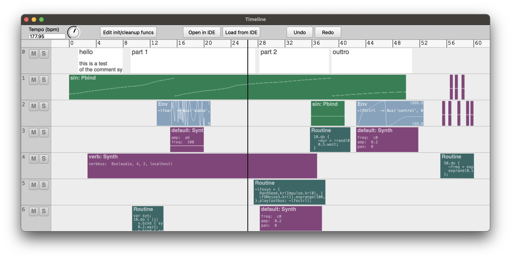

# ESTimeline
A hypothetical general purpose SuperCollider timeline

The distant goal is that anything you can do in SuperCollider could be sequenced on a timeline...




## Features
- Comment, Synth, Pattern, Routine, and Env clips
- Tracks can contain all clip types, and can be muted/soloed
- Non-prescriptive: no server architecture is forced on you, possible to disable timeline-specific clock and environment so as to interact with the timeline as part of a larger project
- Gray playhead is "scheduling playhead" and black playhead is "sounding playhead" -- to take into account server latency. Routines can be played with additional latency so non-sounding events line up with the sounding playhead.
- Most fields can take a Function, so playback params can be generated on the fly
- Pattern, Routine, and Env clips can "fast forward" to start playing in the middle
- Pattern and Routine clips can be seeded so random number generation is deterministic
- Each Timeline can have its own TempoClock and Environment, and has an init / free hook that save with the timeline
- DAW-like GUI with key commands for editing and playback
- Undo and redo
- Easy to export timeline to IDE as compile string and load it back again

## Hypothetical features
- Timeline Clip -- embed one timeline in another!
- Name clips to access them from other clips
- Reference clips to create clones that all change together
- Better GUI editing
  - Selecting / bulk editing clips
  - Insert / delete time
  - Precisely align clips with each other and with grid
- More live interaction - e.g. map a controller to a bus and record its movements to an envelope
- Higher dimensional envelopes - e.g. movement through x/y space
- Playback and record audio files
- Non-linearity: loop points, wait points, etc.
- Indeterminacy: chance for clip not to play?
- ddwPlug integration -- simplify bus routing for modulation
- jitlib integration -- ditto
- clothesline integration -- put whole .scd files on the timeline

## Issues
- Although I've tried to make it pleasant, the GUI based code editing environment does not syntax highlight, autocomplete, etc -- for this reason I've added "Open in IDE" / "Copy from IDE" buttons as necessary.
  - Solution would be to someday add a Qt code view to core SC
- When the timeline gets too big, it can't be saved / restored from a SCLang text format.
  - Solution would be to make some kind of custom file format, or optimize the way functions are stored/loaded.
- When there are lots of quick zig-zags, high-resolution envelope drawing makes the GUI freeze up
  - to avoid this I have extremely pixelated the envelope drawing when zoomed in. Still looking for a good solution for this.

## Mouse interaction
- drag middle of clip to move
- drag edges of clip to resize
- double click on clip to open editor window
- cmd-scroll zoom horizontally
- opt-scroll zoom vertically
- right click to see action menu
- Envelope breakpoint editing (cmd-e to toggle this mode)
  - click and drag to move breakpoints
  - shift-click to add breakpoint
  - opt-click to remvove breakpoint

## Key commands
- space toggles play
- s splits clip at mouse pointer
- delete deletes clip at mouse pointer
- e opens edit window for clip at mouse pointer
- cmd-e toggles mouse editing of envelope breakpoints
- C inserts comment clip at mouse
- S inserts synth clip at mouse
- P inserts pattern clip at mouse
- R inserts routine clip at mouse
- E inserts env clip at mouse
- cmd-t inserts new track after track at mouse
- cmd-T inserts new track before track at mouse
- cmd-delete deletes track at mouse
- cmd-z undo
- cmd-Z redo

## Latest working test code

Empty timeline
```
(
~timeline.free;
~timeline = ESTimeline();
~window = ESTimelineWindow(timeline: ~timeline);
)
```

Test timeline with all elements
```
(
~timeline.free;
~timeline = ESTimeline([
  ESTrack([
    ESClip(1.34, 6.6928763809125, nil, 0, "hello

this is a test
of the comment system.

will this be useful???
..
we will see."),
    ESClip(9.1205806355435, 18.57431739072, nil, -0.072697454367784, "part 1"),
    ESClip(28.23, 10.393658670243, nil, 0, "part 2"),
    ESClip(38.93, 12.023820275648, nil, 0, "outtro")
  ]),
  ESTrack([
    ESPatternClip(0.0, 50.0, {Pbind(
  \instrument, \sin,
  \verbbus, ~verbbus,
  \verbamt, Penv([6, 1, 1, 6, 1, 1], [15, 5, 15, 5, inf]),
  \midinote, Pseries(
    40,
    Pwrand([1, 2, 3], [2, 5, 0.4].normalizeSum, inf)
  ).wrap(30, 120),
  \dur, Pbrown(0.1, 2) + Pwhite(-0.1, 0.1)
)}, 805771862),
    ESSynthClip(56.489889203478, 0.45849025486955, {'default'}, {[
  freq: ~freq
]}, {}, {'addToHead'}),
    ESSynthClip(57.230472977932, 0.45849025486955, {'default'}, {[
  freq: ~freq
]}, {}, {'addToHead'}),
    ESSynthClip(58.22036218141, 0.45849025486955, {'default'}, {[
  freq: ~freq
]}, {}, {'addToHead'})
  ]),
  ESTrack([
    ESEnvClip(13.0, 8, Env([ 0] ++ [1, 0].dup(100).flat, 0.005.dup(200) * (1, 1.04..9.0), 'sin'), {~lfoar}, offset: -2),
    ESPatternClip(35.89, 5.0, {Pbind(
  \instrument, \sin,
  \dur, Pfunc { ~dur }
)}, 121648384),
    ESEnvClip(42.587500627836, 10.009801591488, Env([ 0.0, 0.66236162361624, 1.0, 0.0, 0.37822878228782 ], [ 1.1941517688091, 2.9583476033554, 0.3080087054461, 3.1609899762595 ], [ 'sin', 'sin', 'sin', 'sin' ]), {~lfoctrl}, {}, {'addToHead'}, 100.0, 1000.0, 0.0, false),
    ESSynthClip(55.346017235015, 0.45849025486955, {'default'}, {[
  freq: ~freq
]}, {}, {'addToHead'}), ESSynthClip(56.262581312309, 0.45849025486955, {'default'}, {[
  freq: ~freq
]}, {}, {'addToHead'}), ESSynthClip(57.604431121468, 0.45849025486955, {'default'}, {[
  freq: ~freq
]}, {}, {'addToHead'}), ESSynthClip(58.902285854917, 0.45849025486955, {'default'}, {[
  freq: ~freq
]}, {}, {'addToHead'}), ESSynthClip(59.547546965333, 0.45849025486955, {'default'}, {[
  freq: ~freq
]}, {}, {'addToHead'}) ]), ESTrack([ ESSynthClip(15.0, 5.0, {'default'}, {[
  amp: ~lfoar.asMap,
  freq: 100
]}, {}, {'addToHead'}),
  ESRoutineClip(35.74, 6.01, { 10.do {
   ~dur = rrand(0.1, 1.0);
   0.5.wait;
 }}, 1216896044, true, false, 1, {}),
  ESSynthClip(42.584699114862, 9.24, {'default'}, {[
  freq: ~lfoctrl.asMap,
  amp: 0.2,
  pan: 0,
]}, {}, {'addToHead'})
  ]),
  ESTrack([
    ESSynthClip(2.7364332816384, 34.076391603115, {'verb'}, {[
  verbbus: ~verbbus
]}, {}, {'addToTail'}),
    ESRoutineClip(55.08, 5.0, { 50.do {
   ~freq = exprand(100, 500);
   exprand(0.1, 1).wait;
 };}, 241754095, true, false, 1, {})
  ]),
  ESTrack([
    ESRoutineClip(27.39, 10.65, {~lfosyn = {
  RandSeed.kr(Impulse.kr(0), 12345);
  LFDNoise3.kr(1).exprange(100, 500);
}.play(outbus: ~lfoctrl);}, 684908290, true, false, 1, {~lfosyn.free;})
  ]),
  ESTrack([
    ESRoutineClip(9.35, 4.67, {var syn;
10.do { |i|
  s.bind { syn = Synth(\default, [freq: (40 + i).midicps]) };
  0.2.wait;
  s.bind { syn.free };
  0.2.wait;
};}, 1234300736, true, false, 1, {var syn;
s.bind { syn = Synth(\default) };
0.2.wait;
s.bind { syn.free };
}),
    ESSynthClip(28.29, 9.24, {'default'}, {[
  freq: ~lfoctrl.asMap,
  amp: 0.2,
  pan: 0,
]}, {}, {'addToHead'})
  ])
], 2.9658994189469, {SynthDef(\sin, { |out, freq = 100, gate = 1, amp = 0.1, preamp = 1.5, attack = 0.001, release = 0.01, pan, verbbus, verbamt, vibrato = 0.2|
  var env, sig;
  var lfo = XLine.ar(0.01, vibrato, ExpRand(0.5, 2.0)) * SinOsc.ar(5.4 + (LFDNoise3.kr(0.1) * 0.5));
  gate = gate + Impulse.kr(0);
  env = Env.adsr(attack, 0.1, 0.4, release).ar(2, gate);
  sig = SinOsc.ar(freq * lfo.midiratio) * env;
  sig = (sig * preamp).tanh;
  sig = Pan2.ar(sig, pan, amp);
  Out.ar(out, sig);
  Out.ar(verbbus, sig * verbamt);
}).add;

SynthDef(\testSustain, { |out, freq = 122, sustain = 1, amp = 0.1, pan = 0|
  var sig = Pan2.ar(Gendy1.ar(), pan);
  var env = Env.sine(sustain).ar(2);
  Out.ar(out, sig * env * amp);
}).add;

SynthDef(\verb, { |out, verbbus, gate = 1|
  var in = In.ar(verbbus, 2);
  var env = Env.adsr(10, 0, 1, 1.0).ar(2, gate);
  var verb = NHHall.ar(in) * env;
  Out.ar(out, verb);
}).add;

~verbbus = Bus.audio(s, 2);
~lfoctrl = Bus.control(s, 1);
~lfoar = Bus.audio(s, 1);}, {~verbbus.free;
~lfoctrl.free;
~lfoar.free;});


~window = ESTimelineWindow("Timeline", Rect(0, Window.availableBounds.height - 630, Window.availableBounds.width, 630), ~timeline);
)
```
