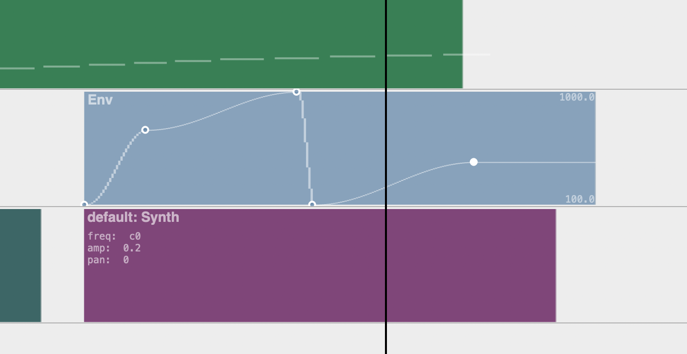
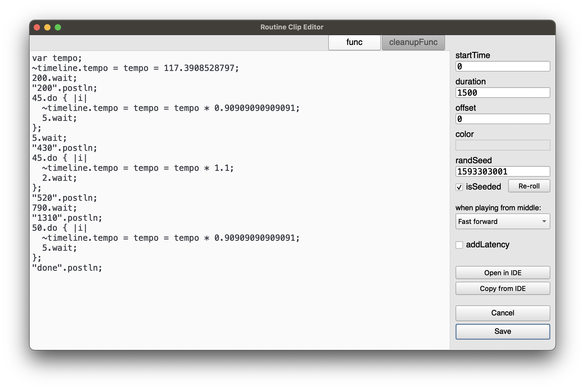

# ESTimeline

The distant goal is that anything you can do in SuperCollider could be sequenced on a timeline...







Timelines inside of timelines with optionally separate play clocks:

[](http://www.youtube.com/watch?v=8jcxcfvS_08 "Video Title")

## Features
- Non-prescriptive: no server architecture is forced on you, possible to disable timeline-specific clock and environment so as to interact with the timeline as part of a larger project; the basic goal is only to "execute this code at this particular time"
- Non-linear: "goto" command to jump to a clip or a point in time
- Synth, Pattern, Routine, and Env clip types
  - Bulk editing selected clip parameters
  - Env clips can manage their own bus
  - Clips can reference other clips in the same timeline, to e.g. apply an Env to a Synth parameter
  - Pattern, Routine, Env, and Timeline clips can "fast forward" to start playing in the middle
    - (there is no way to fast forward a Synth, that I know of....)
  - Pattern and Routine clips can be seeded so random number generation is deterministic
  - Most fields can take a Function, so params can be generated on the fly
- Timeline Clip -- embed one timeline in another!
  - Each timeline clip can optionally use its own TempoClock, and optionally use its own Environment 
  - Each timeline (and timeline clip) has an init / free hook for e.g. allocating and freeing resources
- Tracks can contain all clip types, and can be muted/soloed
- Gray playhead is "scheduling playhead" and black playhead is "sounding playhead" -- to take into account server latency. Routines can be played with additional latency so non-sounding events line up with the sounding playhead.
- DAW-like GUI for editing and playback (see below for mouse and key commands lists)
  - Snap to grid optional
- Undo and redo at each timeline level
- Easy to export timeline to IDE as plain text and load it back again

## Hypothetical features
- Time features
  - Indeterminacy: probability for clips not to play?
  - Clock follow: e.g. sync up with an Ableton timeline or midi show control
- Track/clips
  - Set default params per track (e.g. pan: -1)
  - Reference clips to create clones that all change together
- Envelopes
  - More live interaction - e.g. map a controller to a bus and record its movements to an envelope
  - Higher dimensional envelopes - e.g. movement through x/y space
- Playback and record audio files
  - easily access this Buffer for further manipulation
- Library integration
  - ddwPlug -- simplify bus routing for modulation
  - jitlib -- ditto
  - clothesline -- put whole .scd files on the timeline
  - VSTPlugin, somehow..... this could be a can of worms

## Issues
1. Although I've tried to make it pleasant, the GUI based code editing environment does not syntax highlight, autocomplete, etc -- for this reason I've added "Open in IDE" / "Copy from IDE" buttons as necessary.
  - Solution would be to someday add a Qt code view to core SC
2. When there are lots of quick zig-zags, high-resolution envelope drawing makes the GUI freeze up
  - to avoid this I have extremely pixelated the envelope drawing when zoomed in. Still looking for a good solution for this.
3. There is a limit to the complexity of a timeline created using SCLang (i.e. by evaluating `ESTimeline([ESTrack([....`) -- it may only contain max 256 functions.
  - to avoid this I have created a light custom file format that compiles complex timeline structures from the inside out

## Installing
Download or clone this repository into your SuperCollider Extensions directory. To see where this is, go to `File > Open user support directory` and find the `Extensions` directory, or evaluate:
```
Platform.userExtensionDir
```

## Mouse interaction
- drag middle of clip to move
- drag edges of clip to resize
- double click on clip to open editor window
- right click anywhere to see action menu
- Zooming
  - cmd-scroll zoom horizontally
  - opt-scroll zoom vertically
- Envelope breakpoint editing (cmd-e to toggle this mode)
  - click and drag to move breakpoints or adjust curves
  - shift-click to add breakpoint
  - opt-click to remvove breakpoint
- Selecting
  - click and drag to select both time and clips
    - hold cmd to just select clips
    - hold opt to just select time
  - hold shift to add/remove clips from existing selection
- click and drag tracks to rearrange

## Key commands
- space toggles play
- opt-s toggles snap to grid
- Navigation
  - enter goes to beginning of timeline
  - [ and ] go to next/previous clip edge on track under mouse
- Editing clip
  - s splits clip at mouse pointer
  - delete deletes clip at mouse pointer
  - e opens edit window for clip at mouse pointer, or init/cleanup func window for a timeline clip
  - cmd-e toggles mouse editing of envelope breakpoints
- Insert clip
  - C inserts comment clip at mouse
  - S inserts synth clip at mouse
  - P inserts pattern clip at mouse
  - R inserts routine clip at mouse
  - E inserts env clip at mouse
  - T inserts timeline clip at mouse
- Tracks
  - cmd-t inserts new track after track at mouse
  - cmd-T inserts new track before track at mouse
  - cmd-delete deletes track at mouse
- Seletion
  - cmd-a select all clips
  - cmd-i inserts selected time
  - shift-cmd-delete deletes selected time
- cmd-z undo
- cmd-Z redo

## Basic workflow example
```
(
~timeline = ESTimeline();
~window = ESTimelineWindow(timeline: ~timeline);
)
```
- by default, this boots the default server. You can make it not do this.
- put your SynthDef in the timeline's prep function (click the "edit prep/cleanup funcs" button) e.g.
```
SynthDef(\sin, { |out, freq = 100, gate = 1, amp = 0.1, preamp = 1.5, attack = 0.001, release = 0.01, pan, verbbus, verbamt, vibrato = 0.2|
  var env, sig;
  var lfo = XLine.ar(0.01, vibrato, ExpRand(0.5, 2.0)) * SinOsc.ar(5.4 + (LFDNoise3.kr(0.1) * 0.5));
  gate = gate + Impulse.kr(0);
  env = Env.adsr(attack, 0.1, 0.4, release).ar(2, gate);
  sig = SinOsc.ar(freq * lfo.midiratio) * env;
  sig = (sig * preamp).tanh;
  sig = Pan2.ar(sig, pan, amp);
  Out.ar(out, sig);
  Out.ar(verbbus, sig * verbamt);
}).add;
```
- hit save when you're done to save the prepFunc and load it.
- create a bunch of Synth clips (point the mouse where you want it and press shift-S, or use right click menu)
- if you play now by clicking to place the playhead and pressing space, you will hear they play the default synth
- click in an empty area and drag to select all the Synth clips, right click, "clip actions > bulk edit synth defName", and set them to use your SynthDef.
- double-click in an empty area to remove selection
- play again and you hear this has happened

Envelopes for Synth parameters:
- right click a Synth clip, "clip actions > add env for synth argument"
- pick "freq" from the list and hit OK

Editing Envelopes:
- cmd-e to enter envelope breakpoint editor mode
- move the breakpoints around to adjust, shift-click to add breakpoints, option-click to remove them
- double-click to edit and adjust curves, if you want
- hit cmd-e again to leave envelope breakpoint editor mode (**if you can't move any clips around, this is probably why** -- maybe a design flaw...)

To make this envelope affect all your Synths:
- drag the edges of the envelope clip to resize it
- click and drag to select all the Synth clips, right click, "clip actions > bulk edit synth arguments"
- assign the freq of all the clips to 
`\freq0`
(or whatever the name of the envelope clip is)
- you should see all their freqs change to `a4` -- this is the audio rate bus that the Env clip has created for you (you can override this behavior)
- you should hear it is now controlling all the synths' pitches

Routines and environment variables:
- make a new track, add a Routine clip (shift-R, or use right click menu), double click, and put
```
loop {
  ~pan = rrand(-1.0, 1.0);
  0.1.wait;
};
```
- save the changes to the Routine by pressing "Save"
- select all the Synth clips again, right click, "clip actions > bulk edit synth arguments" and set `pan` to `~pan`
- now you will hear each synth has a random panning, but they are deterministic (same every time you play them)
- if you want them to be truly random (different every time you play them), turn off `isSeeded`

Timeline clips:
- above the main timeline, click "Open as clip in new timeline"
Now this little system, the synths, panning and editable frequency envelope, are all encapsulated in this timeline clip, which won't e.g. interfere with other environment variables called ~pan that you happen to use elsewhere. (in fact you can duplicate the timeline clip by option-dragging onto a new track, and the two will play simultanously each using its own environment and envelope bus.) **If you can't move a clip, hit cmd-e to leave breakpoint editor mode**
- you can also move the mouse cursor over the clip and use the s key to split it into two separate timeline clips.

More advanced sequencing options: using Pattern clips, or using Routine clips to sequence e.g. Synths:
```
var syn;
10.do { |i|
  s.bind { syn = Synth(\default, [freq: (40 + i).midicps]) };
  0.2.wait;
  s.bind { syn.free };
  0.2.wait;
};
```
It's important to use `s.bind` for server operations inside of routines, otherwise the timing is off.

You can think of Routine clips as kind of your generic "execute this code here", and if you want say OSC out to a light board to line up with the sounding events, check the `addLatency` box.

If you do try it out, I would love to know your thoughts, ideas, critiques, and if you find bugs etc please report them here or on the github with steps to reproduce.
