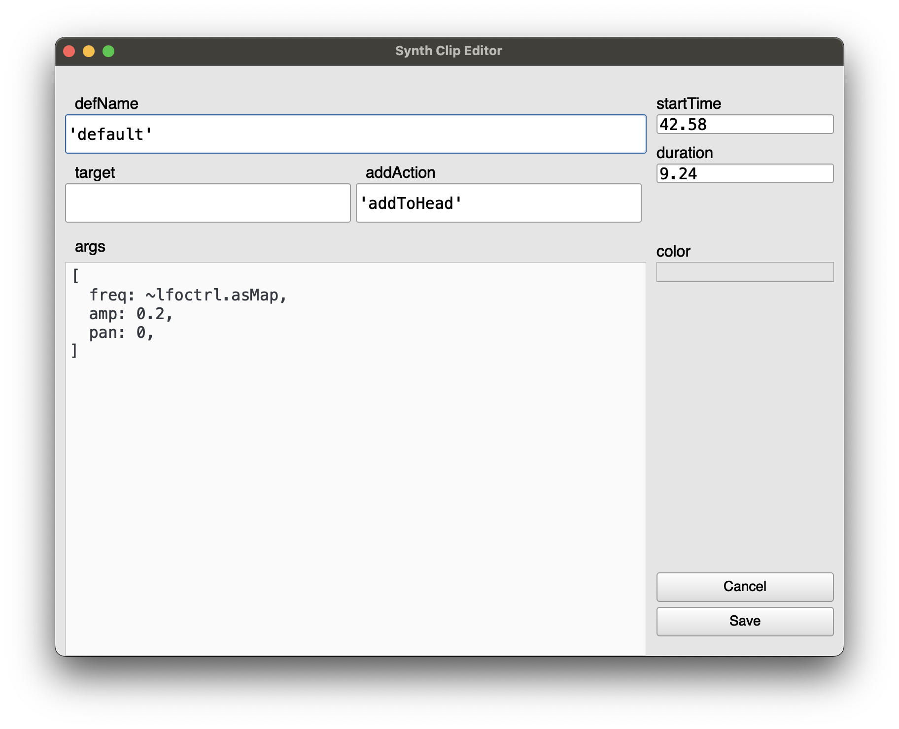

# ESTimeline
A hypothetical general purpose SuperCollider timeline

The distant goal is that anything you can do in SuperCollider could be sequenced on a timeline...





Timelines inside of timelines with optionally separate play clocks:

[](http://www.youtube.com/watch?v=8jcxcfvS_08 "Video Title")

## Features
- Comment, Synth, Pattern, Routine, and Env clip types
- Timeline Clip -- embed one timeline in another!
  - Each timeline clip can optionally use its own TempoClock, and optionally use its own Environment
- Tracks can contain all clip types, and can be muted/soloed
- Non-prescriptive: no server architecture is forced on you, possible to disable timeline-specific clock and environment so as to interact with the timeline as part of a larger project; the basic goal is only to "execute this code at this particular time"
- Gray playhead is "scheduling playhead" and black playhead is "sounding playhead" -- to take into account server latency. Routines can be played with additional latency so non-sounding events line up with the sounding playhead.
- Most fields can take a Function, so params can be generated on the fly
- Pattern, Routine, Env, and Timeline clips can "fast forward" to start playing in the middle
  - (there is no way to fast forward a Synth, that I know of....)
- Pattern and Routine clips can be seeded so random number generation is deterministic
- Each timeline (and timeline clip) has an init / free hook for e.g. allocating and freeing resources
- DAW-like GUI with key commands for editing and playback
- Undo and redo at each timeline level
- Easy to export timeline to IDE as plain text and load it back again

## Hypothetical features
- Set default params per track (e.g. pan: -1)
- Name clips to access them from other clips - e.g. to set Synth params
- Reference clips to create clones that all change together
- Better GUI editing
  - Selecting / bulk editing clips
  - Insert / delete time
  - Snap clips to each other and to grid
- More live interaction - e.g. map a controller to a bus and record its movements to an envelope
- Higher dimensional envelopes - e.g. movement through x/y space
- Playback and record audio files; easily access this Buffer for further manipulation
- Non-linearity: loop points, wait points, etc.
- Indeterminacy: chance for clip not to play?
- Clock follow: e.g. sync up with an Ableton timeline or midi show control
- ddwPlug integration -- simplify bus routing for modulation
- jitlib integration -- ditto
- clothesline integration -- put whole .scd files on the timeline
- VSTPlugin integration, somehow..... this could be a can of worms

## Issues
1. Although I've tried to make it pleasant, the GUI based code editing environment does not syntax highlight, autocomplete, etc -- for this reason I've added "Open in IDE" / "Copy from IDE" buttons as necessary.
  - Solution would be to someday add a Qt code view to core SC
2. When there are lots of quick zig-zags, high-resolution envelope drawing makes the GUI freeze up
  - to avoid this I have extremely pixelated the envelope drawing when zoomed in. Still looking for a good solution for this.

## Installing
Download or clone this repository into your SuperCollider Extensions directory. To see where this is, go to `File > Open user support directory` and find the `Extensions` directory, or evaluate:
```
Platform.userExtensionDir
```

## Mouse interaction
- drag middle of clip to move
- drag edges of clip to resize
- double click on clip to open editor window
- cmd-scroll zoom horizontally
- opt-scroll zoom vertically
- right click to see action menu
- Envelope breakpoint editing (cmd-e to toggle this mode)
  - click and drag to move breakpoints
  - shift-click to add breakpoint
  - opt-click to remvove breakpoint

## Key commands
- space toggles play
- s splits clip at mouse pointer
- delete deletes clip at mouse pointer
- e opens edit window for clip at mouse pointer, or init/cleanup func window for a timeline clip
- cmd-e toggles mouse editing of envelope breakpoints
- C inserts comment clip at mouse
- S inserts synth clip at mouse
- P inserts pattern clip at mouse
- R inserts routine clip at mouse
- E inserts env clip at mouse
- cmd-t inserts new track after track at mouse
- cmd-T inserts new track before track at mouse
- cmd-delete deletes track at mouse
- cmd-z undo
- cmd-Z redo

## Latest working test code

Empty timeline
```
(
~timeline.free;
~timeline = ESTimeline();
~window = ESTimelineWindow(timeline: ~timeline);
)
```

Test timeline with all elements
```
(
~timeline.free;
~timeline = ESTimeline([ESTrack([ESRoutineClip(0, 5, {~timeline.tempoBPM = 120}), ESClip(6, 20, comment: "the timeline clip below\n\nuses its own independent tempo\n\n |\n |\nV"), ESRoutineClip(28, 5, {~timeline.tempoBPM = 300}), ESClip(34, 20, comment: "these routine clips\n\nset this timeline's tempo\n\n<--------"), ESClip(72, 20, comment: "the timeline clip below\n\nis able to set this timeline's tempo\nbecause it has 'useEnvir' unchecked.\nit also plays on this timeline's clock.\n\n |\n |\nV")]), ESTrack([ESTimelineClip(2, 60, ESTimeline([
  ESTrack([
    ESClip(1.34, 6.6928763809125, nil, 0, "hello

this is a test
of the comment system.

will this be useful???
..
we will see."),
    ESClip(9.1205806355435, 18.57431739072, nil, -0.072697454367784, "part 1"),
    ESClip(28.23, 10.393658670243, nil, 0, "part 2"),
    ESClip(38.93, 12.023820275648, nil, 0, "outtro")
  ]),
  ESTrack([
    ESPatternClip(0.0, 50.0, {Pbind(
  \instrument, \sin,
  \verbbus, ~verbbus,
  \verbamt, Penv([6, 1, 1, 6, 1, 1], [15, 5, 15, 5, inf]),
  \midinote, Pseries(
    40,
    Pwrand([1, 2, 3], [2, 5, 0.4].normalizeSum, inf)
  ).wrap(30, 120),
  \dur, Pbrown(0.1, 2) + Pwhite(-0.1, 0.1)
)}, 805771862),
    ESSynthClip(56.489889203478, 0.45849025486955, {'default'}, {[
  freq: ~freq
]}, {}, {'addToHead'}),
    ESSynthClip(57.230472977932, 0.45849025486955, {'default'}, {[
  freq: ~freq
]}, {}, {'addToHead'}),
    ESSynthClip(58.22036218141, 0.45849025486955, {'default'}, {[
  freq: ~freq
]}, {}, {'addToHead'})
  ]),
  ESTrack([
    ESEnvClip(13.0, 8, Env([ 0] ++ [1, 0].dup(100).flat, 0.005.dup(200) * (1, 1.04..9.0), 'sin'), {~lfoar}, offset: -2),
    ESPatternClip(35.89, 5.0, {Pbind(
  \instrument, \sin,
  \dur, Pfunc { ~dur }
)}, 121648384),
    ESEnvClip(42.587500627836, 10.009801591488, Env([ 0.0, 0.66236162361624, 1.0, 0.0, 0.37822878228782 ], [ 1.1941517688091, 2.9583476033554, 0.3080087054461, 3.1609899762595 ], [ 'sin', 'sin', 'sin', 'sin' ]), {~lfoctrl}, {}, {'addToHead'}, 100.0, 1000.0, 0.0, true),
    ESSynthClip(55.346017235015, 0.45849025486955, {'default'}, {[
  freq: ~freq
]}, {}, {'addToHead'}), ESSynthClip(56.262581312309, 0.45849025486955, {'default'}, {[
  freq: ~freq
]}, {}, {'addToHead'}), ESSynthClip(57.604431121468, 0.45849025486955, {'default'}, {[
  freq: ~freq
]}, {}, {'addToHead'}), ESSynthClip(58.902285854917, 0.45849025486955, {'default'}, {[
  freq: ~freq
]}, {}, {'addToHead'}), ESSynthClip(59.547546965333, 0.45849025486955, {'default'}, {[
  freq: ~freq
]}, {}, {'addToHead'}) ]), ESTrack([ ESSynthClip(15.0, 5.0, {'default'}, {[
  amp: ~lfoar.asMap,
  freq: 100
]}, {}, {'addToHead'}),
  ESRoutineClip(35.74, 6.01, { 10.do {
   ~dur = rrand(0.1, 1.0);
   0.5.wait;
 }}, 1216896044, true, false, 1, {}),
  ESSynthClip(42.584699114862, 9.24, {'default'}, {[
  freq: ~lfoctrl.asMap,
  amp: 0.2,
  pan: 0,
]}, {}, {'addToHead'})
  ]),
  ESTrack([
    ESSynthClip(2.7364332816384, 34.076391603115, {'verb'}, {[
  verbbus: ~verbbus
]}, {}, {'addToTail'}),
    ESRoutineClip(55.08, 5.0, { 50.do {
   ~freq = exprand(100, 500);
   exprand(0.1, 1).wait;
 };}, 241754095, true, false, 1, {})
  ]),
  ESTrack([
    ESRoutineClip(27.39, 10.65, {~lfosyn = {
  RandSeed.kr(Impulse.kr(0), 12345);
  LFDNoise3.kr(1).exprange(100, 500);
}.play(outbus: ~lfoctrl);}, 684908290, true, false, 1, {~lfosyn.free;})
  ]),
  ESTrack([
    ESRoutineClip(9.35, 4.67, {var syn;
10.do { |i|
  s.bind { syn = Synth(\default, [freq: (40 + i).midicps]) };
  0.2.wait;
  s.bind { syn.free };
  0.2.wait;
};}, 1234300736, true, false, 1, {var syn;
s.bind { syn = Synth(\default) };
0.2.wait;
s.bind { syn.free };
}),
    ESSynthClip(28.29, 9.24, {'default'}, {[
  freq: ~lfoctrl.asMap,
  amp: 0.2,
  pan: 0,
]}, {}, {'addToHead'})
  ])
], 2.9658994189469, {SynthDef(\sin, { |out, freq = 100, gate = 1, amp = 0.1, preamp = 1.5, attack = 0.001, release = 0.01, pan, verbbus, verbamt, vibrato = 0.2|
  var env, sig;
  var lfo = XLine.ar(0.01, vibrato, ExpRand(0.5, 2.0)) * SinOsc.ar(5.4 + (LFDNoise3.kr(0.1) * 0.5));
  gate = gate + Impulse.kr(0);
  env = Env.adsr(attack, 0.1, 0.4, release).ar(2, gate);
  sig = SinOsc.ar(freq * lfo.midiratio) * env;
  sig = (sig * preamp).tanh;
  sig = Pan2.ar(sig, pan, amp);
  Out.ar(out, sig);
  Out.ar(verbbus, sig * verbamt);
}).add;

SynthDef(\testSustain, { |out, freq = 122, sustain = 1, amp = 0.1, pan = 0|
  var sig = Pan2.ar(Gendy1.ar(), pan);
  var env = Env.sine(sustain).ar(2);
  Out.ar(out, sig * env * amp);
}).add;

SynthDef(\verb, { |out, verbbus, gate = 1|
  var in = In.ar(verbbus, 2);
  var env = Env.adsr(10, 0, 1, 1.0).ar(2, gate);
  var verb = NHHall.ar(in) * env;
  Out.ar(out, verb);
}).add;

~verbbus = Bus.audio(s, 2);
~lfoctrl = Bus.control(s, 1);
~lfoar = Bus.audio(s, 1);}, {~verbbus.free;
~lfoctrl.free;
~lfoar.free;}, useEnvir: true), false ),
ESTimelineClip(70, 50, ESTimeline([ ESTrack([ ESRoutineClip(0.0, 39.23, {inf.do {
  ~timeline.tempoBPM = rrand(20, 60);
  1.wait;
}}, 1897888992, true, false, 1, {}) ]), ESTrack([ ESPatternClip(0.0, 11.97783166732, {Pbind(
  \type, \grain,
  \instrument, \rim, //Pwrand([\rim, \thump], [0.99, 0.01], inf),
  \dur, 0.1,
  //\tempo, Pfunc { ~timeline.tempo },//Pbrown(0.0, 1.0, Pbrown(0.01, 0.25, 0.01)).lincurve(0, 1, 0.9, 20, 3),
  \freq, Pbrown(385, 410, 10) + (Pwhite(15, 50) * Pfunc({ ~timeline.tempo }).linlin(1, 20, 0, 1)),
  \accent, Prand([1, 0, 0, 0], inf),
  \restdummy, Pwrand([Rest(), 1], [1/11, 10/11], inf),
  \db, Pseq([-16, -19, -17, -20] * 1.2, inf) + (Pkey(\accent) * 9),
  \decay, Pseq([0.11, 0.08, 0.09, 0.08], inf),
  \damt, Pseq([0.5, 0.0, 0.0, 0.0], inf),
);}, 1756120386), ESPatternClip(12.081747390425, 0.82335309956894, {Pbind(
  \type, \grain,
  \instrument, \rim, //Pwrand([\rim, \thump], [0.99, 0.01], inf),
  \dur, 0.1,
  //\tempo, Pfunc { ~timeline.tempo },//Pbrown(0.0, 1.0, Pbrown(0.01, 0.25, 0.01)).lincurve(0, 1, 0.9, 20, 3),
  \freq, Pbrown(385, 410, 10) + (Pwhite(15, 50) * Pfunc({ ~timeline.tempo }).linlin(1, 20, 0, 1)),
  \accent, Prand([1, 0, 0, 0], inf),
  \restdummy, Pwrand([Rest(), 1], [1/11, 10/11], inf),
  \db, Pseq([-16, -19, -17, -20] * 1.2, inf) + (Pkey(\accent) * 9),
  \decay, Pseq([0.11, 0.08, 0.09, 0.08], inf),
  \damt, Pseq([0.5, 0.0, 0.0, 0.0], inf),
);}, 1756120386, true, 12.081747390425), ESPatternClip(13.060287116335, 1.9322799239727, {Pbind(
  \type, \grain,
  \instrument, \rim, //Pwrand([\rim, \thump], [0.99, 0.01], inf),
  \dur, 0.1,
  //\tempo, Pfunc { ~timeline.tempo },//Pbrown(0.0, 1.0, Pbrown(0.01, 0.25, 0.01)).lincurve(0, 1, 0.9, 20, 3),
  \freq, Pbrown(385, 410, 10) + (Pwhite(15, 50) * Pfunc({ ~timeline.tempo }).linlin(1, 20, 0, 1)),
  \accent, Prand([1, 0, 0, 0], inf),
  \restdummy, Pwrand([Rest(), 1], [1/11, 10/11], inf),
  \db, Pseq([-16, -19, -17, -20] * 1.2, inf) + (Pkey(\accent) * 9),
  \decay, Pseq([0.11, 0.08, 0.09, 0.08], inf),
  \damt, Pseq([0.5, 0.0, 0.0, 0.0], inf),
);}, 1756120386, true, 13.060287116335), ESPatternClip(15.070937342894, 0.62696242068811, {Pbind(
  \type, \grain,
  \instrument, \rim, //Pwrand([\rim, \thump], [0.99, 0.01], inf),
  \dur, 0.1,
  //\tempo, Pfunc { ~timeline.tempo },//Pbrown(0.0, 1.0, Pbrown(0.01, 0.25, 0.01)).lincurve(0, 1, 0.9, 20, 3),
  \freq, Pbrown(385, 410, 10) + (Pwhite(15, 50) * Pfunc({ ~timeline.tempo }).linlin(1, 20, 0, 1)),
  \accent, Prand([1, 0, 0, 0], inf),
  \restdummy, Pwrand([Rest(), 1], [1/11, 10/11], inf),
  \db, Pseq([-16, -19, -17, -20] * 1.2, inf) + (Pkey(\accent) * 9),
  \decay, Pseq([0.11, 0.08, 0.09, 0.08], inf),
  \damt, Pseq([0.5, 0.0, 0.0, 0.0], inf),
);}, 1756120386, true, 15.070937342894), ESPatternClip(15.784519571703, 22.925480428297, {Pbind(
  \type, \grain,
  \instrument, \rim, //Pwrand([\rim, \thump], [0.99, 0.01], inf),
  \dur, 0.1,
  //\tempo, Pfunc { ~timeline.tempo },//Pbrown(0.0, 1.0, Pbrown(0.01, 0.25, 0.01)).lincurve(0, 1, 0.9, 20, 3),
  \freq, Pbrown(385, 410, 10) + (Pwhite(15, 50) * Pfunc({ ~timeline.tempo }).linlin(1, 20, 0, 1)),
  \accent, Prand([1, 0, 0, 0], inf),
  \restdummy, Pwrand([Rest(), 1], [1/11, 10/11], inf),
  \db, Pseq([-16, -19, -17, -20] * 1.2, inf) + (Pkey(\accent) * 9),
  \decay, Pseq([0.11, 0.08, 0.09, 0.08], inf),
  \damt, Pseq([0.5, 0.0, 0.0, 0.0], inf),
);}, 1756120386, true, 15.784519571703) ]), ESTrack([ ESPatternClip(0.0, 38.674655870445, {Pbind(
  \type, \grain,
  \instrument, \rim,
  \dur, 1,
  \restdummy, Pwrand([Rest(), 1], [1/8, 7/8], inf),
  \db, Pseq([Rest(), Rest(), Rest(), -9], inf),
  \decay, Pseq([0.2], inf)
);}, 491802508) ]), ESTrack([ ESPatternClip(3.6948987854251, 35.769230769231, {Pbind(
  \type, \grain,
  \instrument, \thump,
  \dur, 4,
  \db, -6,
  \spread, 1,
  \release, 0.2
)}, 1748685261, true, 3.6948987854251) ]), ESTrack([ ESPatternClip(0.0, 40.101781376518, {Pbind(
  \type, \grain,
  \instrument, \sub,
  \dur, 1,
  \freq, 50,
  \db, Pseq([Rest(), -9], inf)
);}, 654848795) ]) ], 0.78333333333333, {SynthDef(\thump, { |out, freq = 50, amp = 0.1, preamp = 1.0, spread = 0, attack = 0.0, release = 1.0|
  var sig, env, freqEnv;

  env = Env.perc(attack, release).ar(2);
  freqEnv = env.linexp(0, 1, freq, freq * 100);
  sig = PinkNoise.ar(preamp!2) * env;
  sig = VAMoogLadderOS.ar(sig, freqEnv, 0.0) * 3;
  //sig = RLPF.ar(sig, freqEnv, 3);
  sig = LeakDC.ar(sig);
  sig = Splay.ar(sig, spread);

  Out.ar(out, sig * amp);
}).add;

SynthDef(\rim, { |out, freq = 400, amp = 0.1, decay = 0.08, bamt = 0.2, camt = 0.9, damt = 0.5|
  var sig;
  var a, b, c, d;

  d = SinOsc.ar(454, pi/2) * Env.perc(0, 0.017).ar;
  c = LPF.ar(Hasher.ar(Sweep.ar(Impulse.ar(10), 1) + Rand(0, 1)), 1000) * Env([0, 1], [0.02]).ar;
  b = SinOsc.ar(freq * 4.378);
  a = DynKlang.ar(
    `[
      [4, 6, 9],
      [0.7, 0.2, 0.4],
      (0)!3
    ],
    freq
    * Env([0.8, 1.0], [decay], \exp).ar
    * b.exprange(1 - bamt, (1 - bamt).reciprocal)
    * c.exprange(1 - camt, (1 - camt).reciprocal)
    * d.exprange(1 - damt, (1 - damt).reciprocal)
  );

  sig = a * Env.perc(0, decay * 4, curve: -20).ar(2);

  Out.ar(out, sig!2 * amp);
}).add;

SynthDef(\sub, { |out, freq = 50, attack, release = 0.3, amp = 0.1|
  var sig = SinOsc.ar(freq, pi/2) * Env.perc(attack, release).ar(2);
  Out.ar(out, sig!2 * amp);
}).add;

SynthDef(\fx, { |out, gate = 1|
  var in = In.ar(out, 2);
  var verb = NHHall.ar(in, 0.5, 1, 200, 1.5, 2000, 0.5, 0.7);
  var env = Env.asr(0.01, 1.0, 2.0).kr(2, gate);
  var sig = (in + ((in * 4).tanh / 4)) / 2;
  sig = sig + (verb * -6.dbamp);
  ReplaceOut.ar(out, sig);
}).add;}, {}, useEnvir: false), true)
]), ESTrack(100.collect { |i| ESSynthClip(i, 0.05, \default, [freq: rrand(80, 110).midicps, amp: rrand(-30, 0).dbamp]) })]);


~window = ESTimelineWindow("Timeline", Rect(0, Window.availableBounds.height - 630, Window.availableBounds.width, 630), ~timeline);
)
```
